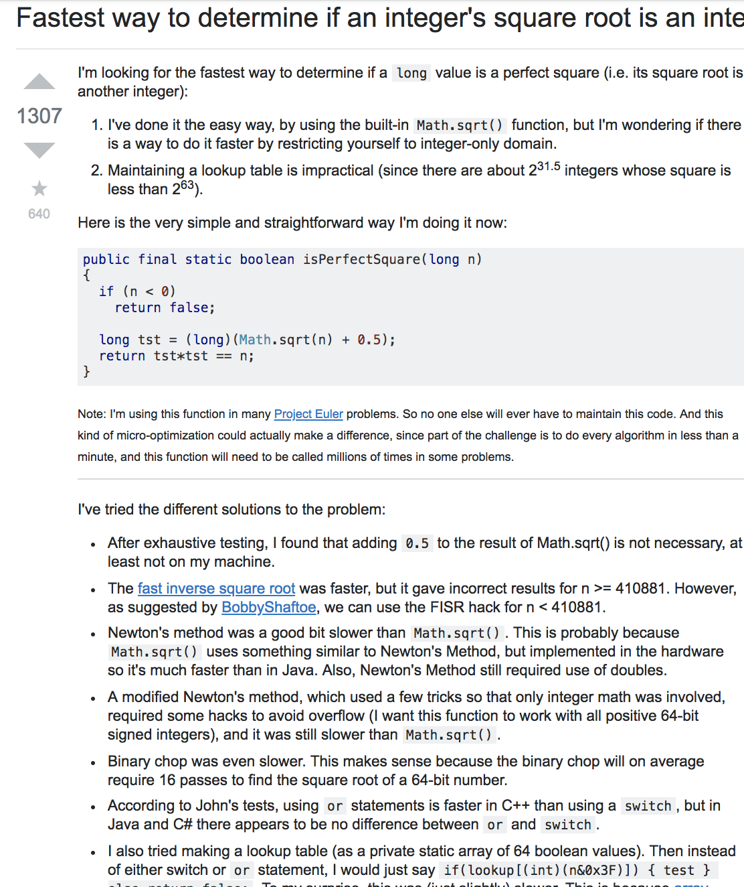

In everyday life, we are always learning something new due to our curiosity about how the world works or why things are the way they are. And the thing is that, although some answers may come naturally, most of the time these answers will never come to you without asking the question! And I emphasize this when it comes to software engineering, as in this field of study there is almost nothing that is intuitive once you dive deeper into coding.

## Well, what exactly is "smart" questioning?

After reading Eric Raymond's "How to ask questions the smart way", I believe that smart questioning comes down to designing a question that pinpoints what exactly needs to be answered, and more importantly showing that the asker has shown that they have put a reasonable amount of thought into attempting to answering it for themselves before seeking others for assistance. In Software engineering, there will always be more than one solution to a problem. So when asking a question on how to solve something, it is just too vague because you are inadvertently asking someone to do your work for you! Here is an example of what I mean.

Notice how this question is extremely non-constructive. The question in itself gives off the impression that the person who asked the question has made no steps to approaching what they want to achieve! They want to send out 100,000 emails using PHP, but they have little to no idea as what they want to find out in order to do what they want to do. Before asking for help on a forum such as Stack Overflow, it is important to do extensive self-research on how to write code that can do that certain task, and have that knowledge in your head to share with others when you request for help in a forum. 

## Now take a look at this question:

Aside from the up/downvote difference, look at the difference of the content in the question! This person has obviously done their own research and have listed what they have attempted in efforts of finding a solution to it such as utilizing the provided functions in their code environment. They have tried their best to solve it on their own and prevented other people who are trying to answer it from possibly doing the same thing as well. These pieces of information allow the people to connect the information and try to form an explanation for it. 

## So what have we learned?

In a way, question asking is pretty much gaining as much as you put in to it. This does vary from situation to situation, but in order to get the right answer, you must ask the right questions. The right questions can never come to if you don't know, what you don't know. And I personally find myself in that position of not knowing what to ask. It's a matter of knowing the basics of something, attempting to break down the complex things into these basic concepts that you can understand, and ultimately questioning your approach to see if what you are doing is correct.

