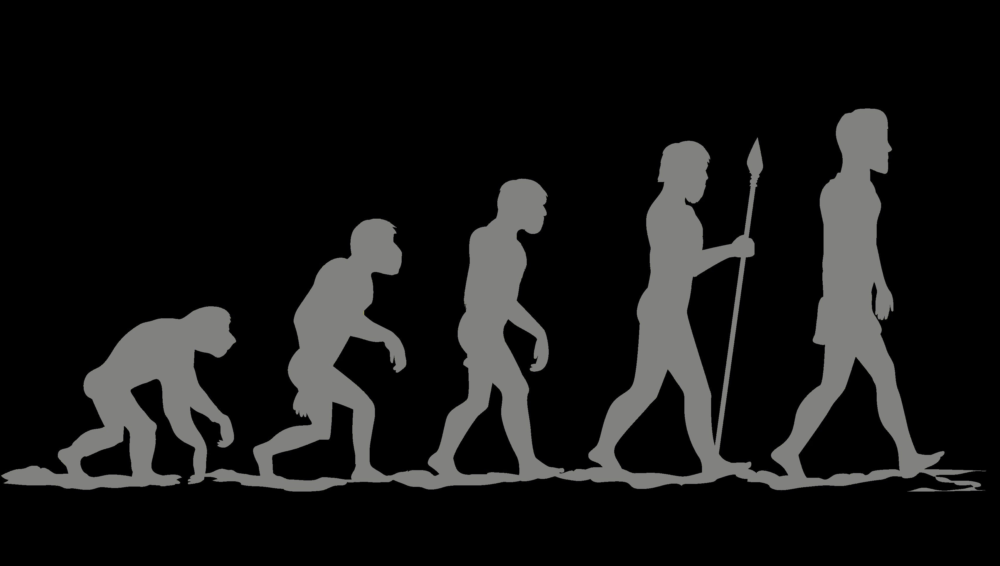

## My Belief

 Think about the evolution of humans through the course of time. Take a look back at our race thousands of years ago. Our physical and mental capabilities were very limited (and still are to a certain extent), and most importantly, flawed. As a consequence we may get sick, injured, and maybe even killed. But after facing much adversity, how is it that we are still the most prominent race on planet earth? 

At this point you probably already guessed it, recovery and adaptation. Humans embody the entity of evolution and as we continuously cycle through the process of reproduction and death, we slowly overcome obstacles and eventually, inhabit the earth. As the cycle continues, the things we do, the things we change, whether it may be good or bad, are always occurring with the intent of solving a problem or multiple. 

## So what am I getting at?

 This embodiment of the Human evolution cycle of life and death is how I view Design Patterns to be. Like the Observer design pattern, to face adversity is to adapt, to change. Similarly to Meteor and IntelliJ, we are always making those changes in our code and updating it with the intent of solving a problem. And sometimes these changes may work, and sometimes they may make things worse. But the main goal is that through repeated efforts of change, we can hope to achieve something great.

Thanks for reading!
