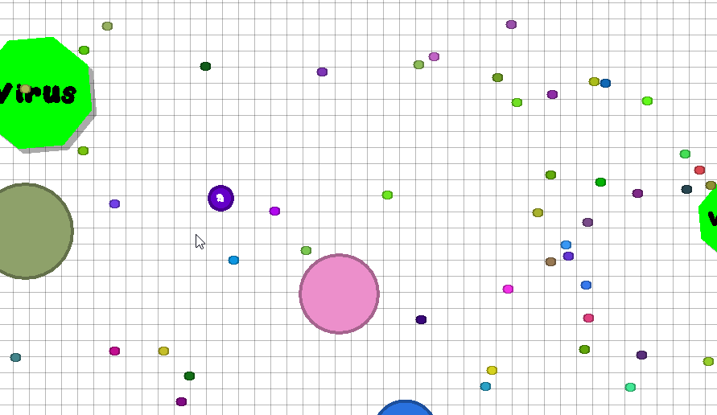
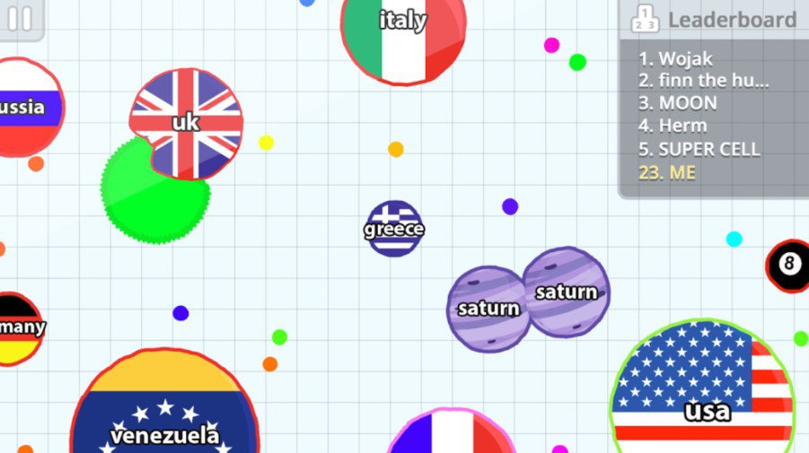

For my final project in my ICS 111 course at UH Manoa, we were assigned in small groups of four to create a game that utilizes EZ Graphics, a custom Java library that allows the user to create animations and pictures in a window resolution determined by the user. Before starting the actual programming, we were responsible for creating an outline for the game such as the concept of it, and what kind of classes in Java we need to create for the whole project. They did this so that each member is responsible for contributing an equal amount of effort and work into the whole project (which I personally thought was an excellent idea). 

## History of our game

Our game is based off of a simple, yet popular game that blew up in 2015 called [agar.io](http://agar.io/). Although the original game was written in Javascript and C++, we thought it was a good idea to write it in Java to demonstrate our understanding of the language itself. Here is a comparison between our game (left) and the original (right):

 

## Well, how do you play it?

