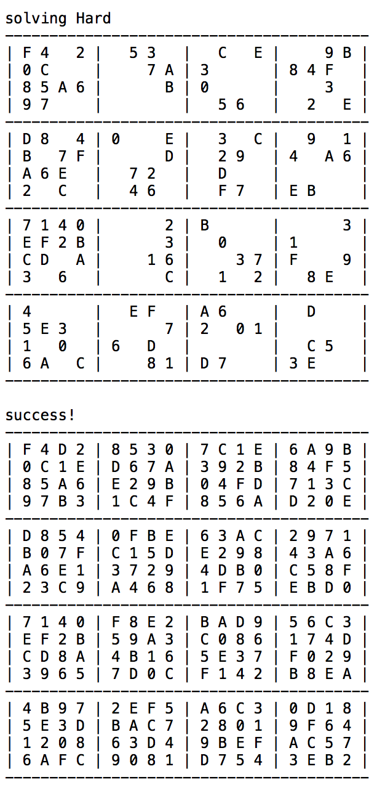

Out of all my numerous projects that I have done in my ICS program, this one has been the most challenging so far, without a doubt. Personally, what made it very challenging was the fact that it was recursive. Our objective was to create a 16x16 sudoku table that is able to recursively check through every 4x4 cell and ultimately solve the sudoku, or determine if the puzzle is not solvable.

## Thinking logically

Looking at the assignment initially, having to code a sudoku puzzle was something that I couldn't wrap my head around. Drawing a sudoku puzzle is easy, but coding it? No thank you. But then there was one key element that allowed the assignment to make sense to me, and that was the type of data structure we utilized to represent the puzzle, a 2D array. That 2D array represented an X and Y axis of a board, and allowed us to store data in each space through loops and such. 

Here is a small snippet of the code assignment that checks to see if the sudoku puzzle is in a valid 16x16 structure. This definitely helped me to visualize the sudoku puzzle through code:
```java
public static boolean checkSudoku(int[][] sudoku, boolean printErrors) {
    if (sudoku.length != 16) {
      if (printErrors) {
        System.out.println("sudoku has " + sudoku.length + " rows, should have 16");
      }
      return false;
    }
    for (int i = 0; i < sudoku.length; i++) {
      if (sudoku[i].length != 16) {
        if (printErrors) {
          System.out.println("sudoku row " + i + " has " + sudoku[i].length + " cells, should have 16");
        }
        return false;
      }
    }
```
## Output of the sudoku program

The console will print the hexadecimal sudoku before and after the sudoku puzzle is solved.
 


## What have I gained from it?

Doing this Hexadecimal Sudoku Solver has further expanded my understanding of Java and how recursion works. More importantly it actually gave me the perspective in how computers think as opposed to humans. There is a very specific and definitive way in which how computers do things because computers only execute what they are specifically told whereas humans have their own ways of solving things. This assignment really got you to critically think in the way of a computer and how it would solve a hexadecimal sudoku puzzle.
