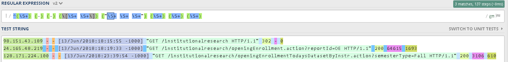
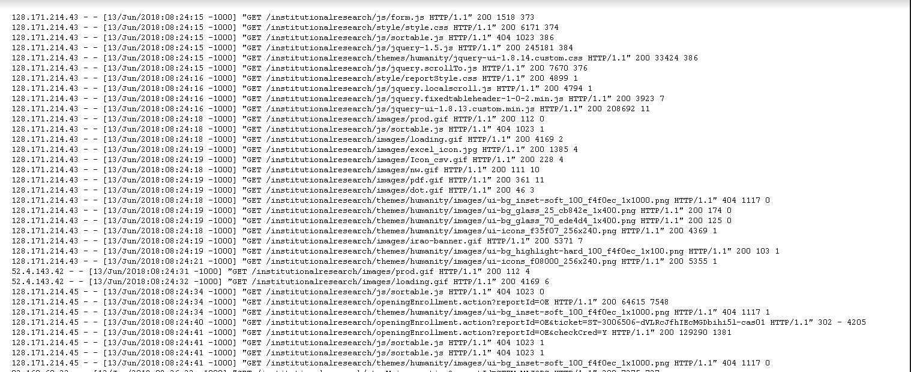

As an office assistant in the UH System Institutional Research and Analysis Office (IRAO), every now and then I receive projects from IT Specialists for the purpose of benefitting our department as well as receiving real-world experience as a coder. For the past couple of months I have been chipping at this long term project on the side and I really appreciate how it consistently refreshes me on Java since I am always learning new coding languages every semester in school.

## What have I accomplished so far?

So far I have been introduced to Regex (Regular Expression), a string of text that allows you to create patterns that help match, locate, and manage text. Personally I found it to be extremely easy and fun to use.

 

I have been slowly getting used to it as eventually I will be utilizing it to parse an access log such as this:

 

The regex string will then be put into a java program that can read an access log text file and store each line within the log to an Array List of Log Entry type objects. As we can see in the code below that there is the regex string being used to put the parsed strings into organized groups that can be used to access later on.

```java
public class DAPIRLogs {

	public static void main(String[] args) {

		/***************************************	
		TODO:Change the file location to someplace local 
		****************************************/
		
		// The name of the file to open.
		String fileName = "C:\\Users\\IT4\\Desktop\\logs\\access_log.2018-06-13.txt";
		
		
		/***************************************	
		END TODO			 
		****************************************/

		// This will reference one line at a time
		String line = null;	

		try {
			
			/***************************************	
			TODO: Create an Arraylist that contains a list of LogEntry.			 
			****************************************/
			
			// do something here
			
			/***************************************	
			END TODO			 
			****************************************/
			
			String regex = "^(\\S+) (-) (-) (\\[\\S+ \\S+\\]) (\"\\S+ \\S+ \\S+\") (\\S+) (\\S+) (\\S+)";
			Pattern p = Pattern.compile(regex);
			FileReader fileReader = 
					new FileReader(fileName);	

			BufferedReader bufferedReader = 
					new BufferedReader(fileReader);
			while((line = bufferedReader.readLine()) != null) {
				//ignore these lines
				if(line.contains("themes/") ||
						line.contains("js/") ||
						line.contains("/images/") ||
						line.contains("/style")){
					continue;
				}
				
				
				/***************************************	
				TODO: Create a new LogEntry for every match and add it to the list 
				group 1 = ip
				group 2 = dash1
				group 3 = dash2
				group 4 = date
				group 5 = url
				group 6  = returnCode	 
				
				To access a group from the matcher class, for example: call  m.group(1) to get group 1  
				****************************************/
						
				Matcher m = p.matcher(line);
				while(m.find()){ 				
					//do something
				}		
			}   
			// Always close files.
			bufferedReader.close();
			
			/***************************************	
			TODO: print out the size of the array list. It should be 534	 
			****************************************/

			// do something here			
			
			/***************************************	
			END TODO			 
			****************************************/
			
		}
```

I find this project fascinating just because I feel that this program is one that is practical in today's society. There are always going to be people accessing data around the world, so it's important to make sure that the data being accessed is secure and not being accessed by just anyone. I will be slowly updating this page as the project is still yet to be completed.
